<!-- Header -->

  

  

  
  
  

---

###  About me

- 📱 Flutter & Android developer — I build cross-platform mobile apps
- 🔭 Currently working on logistics / delivery mobile apps
- 🌱 Always learning: clean architecture, state management, performance
- ⚡ Fun fact: `flutter run` is my favourite command

---

### 🏢 Organizations & Projects

<table align="center">
  <tr>
    <td align="center" width="160">
       
      <b>DMS Express</b> 
      Logistics &amp; delivery
    </td>
    <td align="center" width="160">
       
      <b>Oq Yo'l</b> 
      Ride-hailing app
    </td>
    <td align="center" width="160">
       
      <b>Kino Hub</b> 
      Movie streaming app
    </td>
  </tr>
</table>

---

### 🛠️ Languages and Tools

  

---

### 📊 My GitHub Stats

  
  

### 🔥 My Streak

  

### 🏆 My Ranks

  

### 🐍 Contribution Snake

<picture>
  <source media="(prefers-color-scheme: dark)" srcset="https://raw.githubusercontent.com/Otabek-Oripov/Otabek-Oripov/output/github-snake-dark.svg" />
  <source media="(prefers-color-scheme: light)" srcset="https://raw.githubusercontent.com/Otabek-Oripov/Otabek-Oripov/output/github-snake.svg" />
  
</picture>

### ✍️ Random Dev Quote

  

<!-- Footer -->

  

